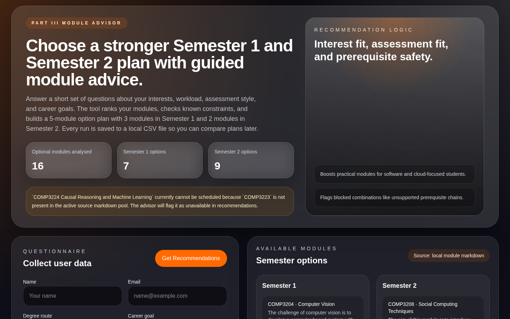
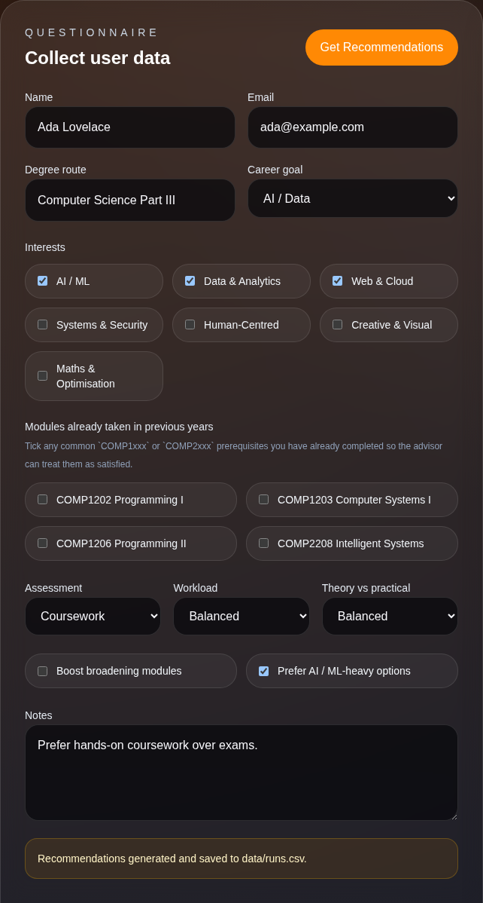
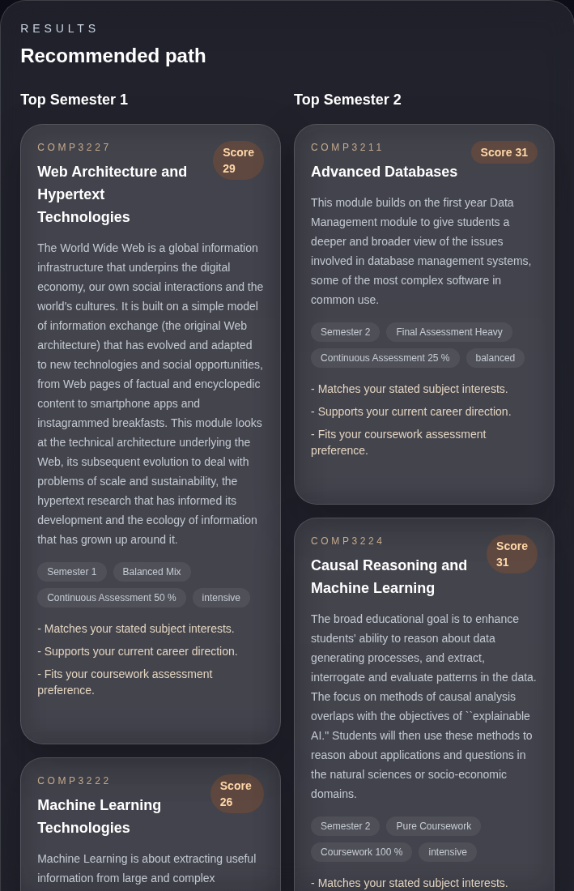
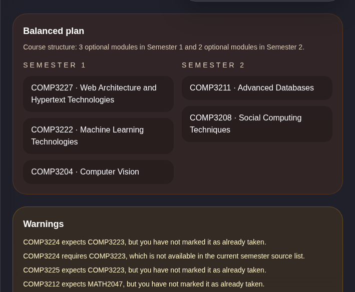
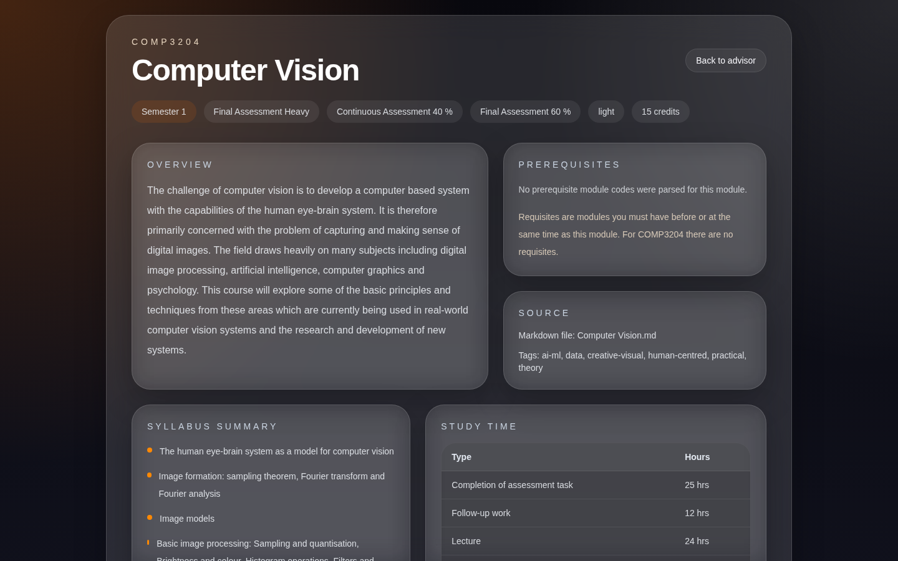

# Part III Module Advisor

A local web app that helps Computer Science students choose their optional Part III modules. Answer a short questionnaire about your interests, preferred assessment style, workload and career goals, and the advisor ranks the Semester 1 and Semester 2 modules, flags prerequisite problems, and suggests a balanced 5-module plan (3 modules in Semester 1, 2 in Semester 2).

Everything runs on your own machine: no accounts, API keys, or database. Every run is saved to a CSV file so you can compare plans later.



## Contents

- [What it does](#what-it-does)
- [Screenshots](#screenshots)
- [Setup](#setup)
- [Using the advisor](#using-the-advisor)
- [Saved runs (CSV)](#saved-runs-csv)
- [Troubleshooting](#troubleshooting)
- [Running tests](#running-tests)
- [How the advisor works](#data-source)

## What It Does

- collects your preferences through a guided questionnaire
- ranks modules for Semester 1 and Semester 2, with a score and the reasons behind it
- checks known prerequisite constraints, including modules you took in earlier years
- builds a balanced 5-module plan with 3 options in Semester 1 and 2 in Semester 2
- links to a detail page for every module (overview, syllabus, assessment, study time)
- saves every run as a row in a local CSV file (`data/runs.csv`)

## Screenshots

**1. Fill in the questionnaire.** Pick your interests, career goal, assessment and workload preferences, and any earlier modules you have already taken.



**2. Review the ranked modules.** Each recommendation shows its score, assessment breakdown, workload profile, and why it matched your answers.



**3. Check the balanced plan and warnings.** The advisor picks 3 + 2 modules that satisfy known prerequisites and lists anything you should double-check.



**4. Open a module for details.** Every module has its own page built from the source markdown.



## Setup

### Prerequisites

| Tool | Version | Check with |
| --- | --- | --- |
| [Node.js](https://nodejs.org/) (includes npm) | 20.19 or newer, or 22.12 or newer (the current LTS is recommended) | `node -v` |
| [Git](https://git-scm.com/downloads) | any recent version | `git --version` |

The steps below work the same in a macOS/Linux terminal and in Windows PowerShell or Command Prompt.

### Steps

1. **Clone the repository** and move into it:

   ```bash
   git clone https://github.com/dragonfisher29/Part-III-Module-Advisor.git
   cd Part-III-Module-Advisor
   ```

2. **Install dependencies** (only needed the first time, and after pulling updates):

   ```bash
   npm install
   ```

   This installs the exact versions pinned in `package-lock.json`. It takes under a minute and needs an internet connection.

3. **Start the app:**

   ```bash
   npm run dev
   ```

   Wait until the terminal shows something like:

   ```text
   ▲ Next.js 15.5.x
   - Local:        http://localhost:3000
   ✓ Ready in 1572ms
   ```

4. **Open [http://localhost:3000](http://localhost:3000)** in your browser. Keep the terminal open while you use the app; press `Ctrl + C` in the terminal to stop it.

### Updating to the latest version

```bash
git pull
npm install
npm run dev
```

## Using the Advisor

1. Fill in your name, email, and degree route, then choose a career goal.
2. Tick at least one interest, plus any `COMP1xxx` / `COMP2xxx` modules you have already completed so their prerequisites count as satisfied.
3. Choose your preferred assessment style, workload, and theory/practical balance, and optionally add notes.
4. Click **Get Recommendations**. The results appear on the right (below the form on narrow screens), and the run is saved to `data/runs.csv`.
5. Click a module name to open its detail page, then **Back to advisor** to return. Change any answer and submit again to compare plans.

## Saved Runs (CSV)

Each submission appends one row to `data/runs.csv` in the project folder. The file and folder are created on the first run, and the first line holds the column names. Open the file in Excel, Numbers, Google Sheets, or any text editor.

| Column | Example |
| --- | --- |
| `saved_at` | `2026-10-02T10:11:37.016Z` (UTC) |
| `name`, `email`, `degree_route` | `Ada Lovelace`, `ada@example.com`, `Computer Science Part III` |
| `interests` | `ai-ml; data; web-cloud` |
| `assessment_preference`, `workload_preference`, `career_goal` | `coursework`, `balanced`, `ai-data` |
| `broadening_interest`, `ai_ml_interest` | `false`, `true` |
| `prior_modules` | `COMP1202; COMP2208` (empty if none) |
| `theory_practice_balance`, `notes` | `balanced`, `Prefer hands-on coursework over exams.` |
| `plan_semester_1` | `COMP3227 Web Architecture and Hypertext Technologies; COMP3222 Machine Learning Technologies; COMP3204 Computer Vision` |
| `plan_semester_2` | `COMP3211 Advanced Databases; COMP3208 Social Computing Techniques` |
| `top_semester_1`, `top_semester_2` | the top 5 ranked modules for each semester |
| `warnings` | `COMP3224 expects COMP3223, but you have not marked it as already taken.; ...` |

List values are separated by `; `. Fields containing commas, quotes, or line breaks are quoted, so spreadsheet apps read them correctly.

`data/` is git-ignored, so your saved runs (which include names and emails) are never committed. To start fresh, close the file in any spreadsheet app and delete `data/runs.csv`.

## Troubleshooting

| Problem | Fix |
| --- | --- |
| `node` or `npm` is not recognised | Install Node.js from [nodejs.org](https://nodejs.org/), then open a new terminal. |
| `npm warn EBADENGINE` or errors mentioning an unsupported Node version | Your Node.js is too old. Install the current LTS and run `npm install` again. |
| `npm install` fails with `Cannot read properties of null (reading 'edgesOut')` | `package-lock.json` is missing or modified. Restore it with `git checkout package-lock.json`, then run `npm ci`. |
| `Port 3000 is in use ... using available port 3001 instead` | Another app is using port 3000, so Next.js picked the next free port. Open the `Local:` URL printed in the terminal (for example `http://localhost:3001`). |
| "Recommendations generated, but saving the run failed" | The app could not write `data/runs.csv`. Close the file if it is open in Excel (which locks it) and check that the project folder is writable. |
| A change to a module's markdown does not show up | Stop the server with `Ctrl + C` and run `npm run dev` again. |

## Running Tests

```bash
npm test
```

## Project Structure

```text
source/              module and programme markdown the catalog is built from
src/app/             Next.js pages (advisor, module detail) and the /api/advice route
src/components/      the questionnaire and results UI
src/lib/             catalog parsing, scoring, validation, and CSV run logging
data/runs.csv        your saved runs (created on first submit, git-ignored)
docs/images/         README screenshots
```

## Data Source

The recommendation catalog is generated from the markdown files in the `source/` folder, including:
- `Semester I.md`
- `Semester II.md`
- per-module markdown files such as `Computer Vision.md` and `Natural Language Processing.md`

## Advisor Logic

The advisor combines questionnaire answers with metadata parsed from the module markdown files. Each module carries tags such as `ai-ml`, `data`, `web-cloud`, `practical`, and `theory`, plus assessment and prerequisite data extracted from the source content.

### Inputs Used By The Advisor

- interests: boosts modules whose tags match the selected subject areas
- career goal: adds extra weight for tags aligned with software engineering, AI/data, research, cybersecurity, product/UX, or an undecided path
- assessment preference: supports `Coursework`, `Exam`, `Continuous Assessment`, and `Final Assessment`
- workload preference: boosts modules whose inferred workload profile matches `light`, `balanced`, or `intensive`
- theory vs practical balance: boosts modules tagged as `theory` or `practical`
- broadening interest: boosts the maths broadening modules when explicitly requested
- AI/ML preference: gives additional weight to modules tagged `ai-ml`
- prior modules: treats selected `COMP1xxx` and `COMP2xxx` modules as already satisfying known prerequisites

### Scoring Model

For each module, the advisor builds a score from several signals:

- interest match: each matching boosted interest tag adds `+3`
- career alignment: each matching career tag adds `+2`
- workload match: exact workload match adds `+2`
- theory/practical match: matching the preferred study style adds `+2`
- broadening boost: selecting broadening interest adds `+4` to supported maths modules
- broadening penalty: not selecting broadening interest subtracts `1` from those maths modules
- AI/ML boost: selecting the AI/ML preference adds `+3` to modules tagged `ai-ml`
- special-case boost: `COMP3222` gets an additional `+2` when AI/ML preference is enabled

Assessment preference is handled separately so the advisor can use both coarse categories and detailed parsed assessment data:

- `Coursework`: strongest match for pure coursework modules, then for coarse coursework modules, then for modules whose tags mention coursework or continuous assessment
- `Exam`: strongest match for pure exam modules, then for coarse exam modules, then for modules whose tags mention exam, examination, or final assessment
- `Continuous Assessment`: strongest match for continuous-assessment-heavy modules, then keyword matching against parsed assessment tags
- `Final Assessment`: strongest match for final-assessment-heavy modules, then keyword matching against parsed assessment tags

Workload tagging is also derived from parsed source data rather than hard-coded labels. Every 15-credit module has the same total study-time budget, so the workload classifier does not use the raw total hours as a differentiator. Instead, it parses each module's `Study Time` table and compares how that fixed budget is distributed across:

- assessment-task time
- contact teaching time
- practical delivery time such as labs, workshops, or studio sessions
- independent study time such as reading, preparation, and revision

That split is then used to infer `light`, `balanced`, or `intensive`. Modules with a large assessment share or a heavy practical/contact mix tend to be marked `intensive`, while modules dominated by independent study with a low assessment share tend to be marked `light`.

The advisor also generates short explanation strings for the UI, such as why a module matched the user's interests, workload, or assessment preference.

### Ranking And Plan Construction

The engine ranks Semester 1 and Semester 2 modules separately, then returns:

- top Semester 1 recommendations
- top Semester 2 recommendations
- a balanced five-module plan containing `3` Semester 1 modules and `2` Semester 2 modules

The balanced plan is built in order:

1. choose the highest-ranked Semester 1 modules until three are selected
2. avoid selecting `COMP3223` if `COMP3222` has already been chosen in the Semester 1 plan
3. evaluate Semester 2 modules against prerequisite blockers before adding them
4. keep the first two Semester 2 modules that are not blocked

### Prerequisite Handling

The advisor checks each module's prerequisite list against:

- modules already selected earlier in the balanced plan
- modules the user marked as already taken in previous years

If a prerequisite is missing, the advisor records a warning and skips that blocked Semester 2 candidate in the balanced plan. It also includes a couple of explicit domain rules:

- `COMP3225` requires a prior machine learning module such as `COMP3222` or `COMP3223`
- `COMP3224` depends on `COMP3223`, which may be unavailable in the current source list

This means the returned plan aims to be practical rather than purely score-maximizing: a highly ranked module can still be excluded if the prerequisite chain is not satisfied.

## Notes

- recommendations are advisory rather than official enrolment decisions
- the app surfaces prerequisite warnings where source data is incomplete or unavailable
